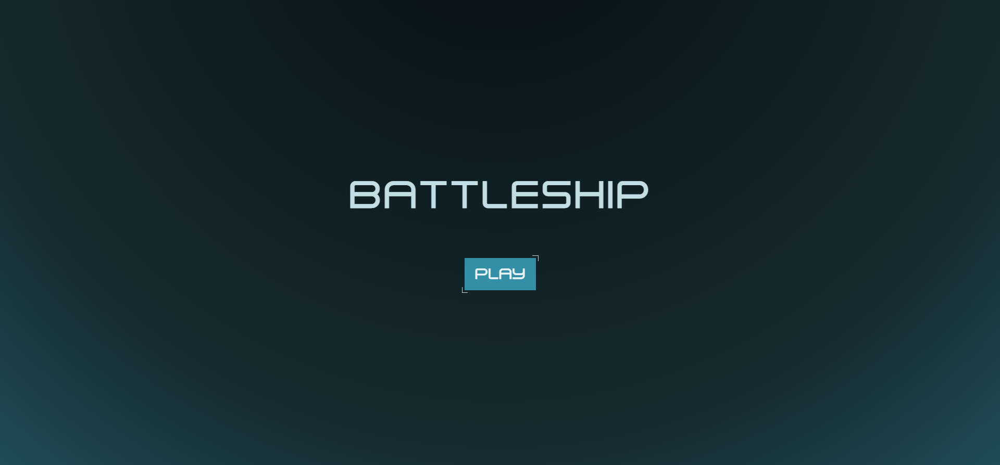
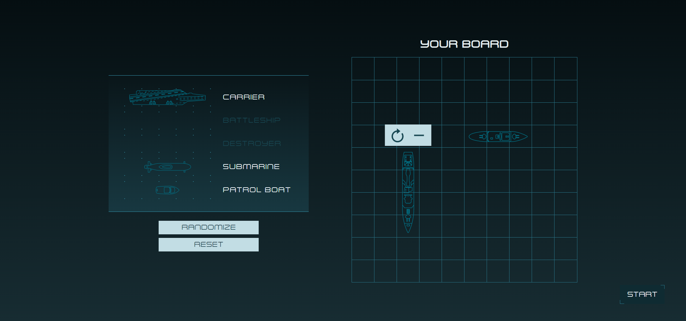
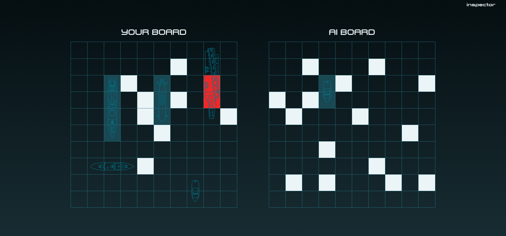
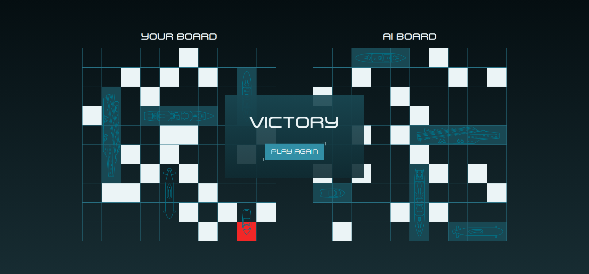

# Battleship

An attempt to recreate the popular board (or paper and pencil) game with the personal motivation of enhancing skills in html, css, and vanilla javascript.

## Play a game

You can try the game by [this link](https://battleship-garth.netlify.app/).

## Screenshots

## Spoilers!

The AI uses techniques called parity and probability density functions (from [Data Genetics blog](https://www.datagenetics.com/blog/december32011/) in 2011) in which it checks all possible locations the enemy ships could fit in and calculates for the most probable cell to fire at next.
